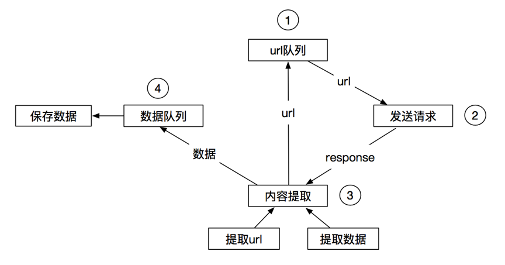
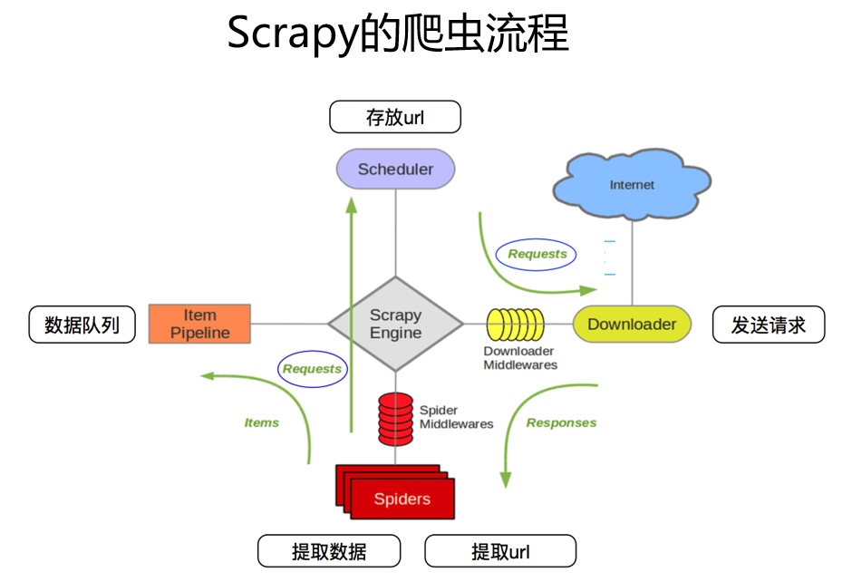
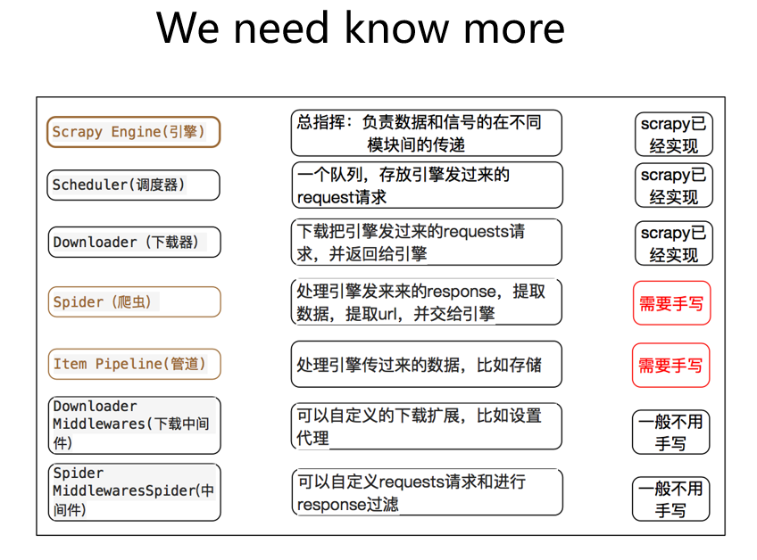

# Scrapy框架

- 模块：
- 框架：包含模块

Scrapy使用了**Twisted**(扭曲)**异步**网络框架，可以加快下载速度

同步/异步  阻塞/非阻塞

### Scrapy工作流程：

----

----

### Scrapy安装：

Linux 下直接：

	pip install scrapy

windows下安装会报以下错误：
  
  	error: Microsoft Visual C++ 14.0 is required. Get it with "Microsoft Visual C++ Build Tools": http://landinghub.visualstudio.com/visual-cpp-build-tools
  - 错误提示的链接已经失效，需要去微软下载，整个下载 **1G** 多
  - 解决方案1：（但是并没成功）
	1. 从此链接下载Microsoft Visual C ++生成工具：https：//visualstudio.microsoft.com/downloads/
	2. 向下滚动到 **用于Visual Studio 2017的工具**
	3. 运行安装程序
	4. 选择：**工作负载**----**Visual C ++构建工具**
	5. 安装选项：仅选择“Windows 10 SDK”（假设计算机是Windows 10）
  - 解决方案2：
    1. 安装Anaconda（600多M）
    2. conda install -c conda-forge scrapy

----

### Scrapy 入门：

1. 新建scrapy项目：

		scrapy startproject <项目名称>

		scrapy startproject mySpider
		New Scrapy project 'mySpider', using template directory 'C:\\ProgramData\\Anaconda3\\lib\\site-packages\\scrapy\\templates\\project', created in:
		    C:\Users\Administrator\PycharmProjects\mySpider
		
		You can start your first spider with:
		    cd mySpider
		    scrapy genspider example example.com
2. 生成一个爬虫：

		cd <项目目录>
		scrapy genspider <爬虫名称> <'允许范围'>

		cd mySpider
		scrapy genspider baidu "baidu.com"
		Created spider 'baidu' using template 'basic' in module:
		  mySpider.spiders.baidu

  - 生成的文件目录树

			[root@localhost mySpider]# tree
			.
			├── mySpider
			│   ├── __init__.py
			│   ├── items.py
			│   ├── middlewares.py
			│   ├── pipelines.py
			│   ├── __pycache__
			│   │   ├── __init__.cpython-36.pyc
			│   │   └── settings.cpython-36.pyc
			│   ├── settings.py
			│   └── spiders
			│       ├── baidu.py
			│       ├── __init__.py
			│       └── __pycache__
			│           └── __init__.cpython-36.pyc
			└── scrapy.cfg
3. 提取数据
  - 完善spider, 使用xpatht等方法
  
			class ItcastSpider(scrapy.Spider):
			    name = 'itcast'
			    allowed_domains = ['itcast.cn']
			    start_urls = ['http://www.itcast.cn/channel/teacher.shtm']
			
			    def parse(self, response):
			        li_list = response.xpath("//div[@class='tea_con']//li")
			        for li in li_list:
						item = {}
						item['name'] = li.xpath(".//h3/text()").extract_first()
						# extract()[0] 取第一个元素，如果没有则会报错
						# extract_first() 取第一个元素，如果没有则会返回 None
						# must return Request, BaseItem, dict or None
						yield item  # 减少内存占用
4. 保存数据
  - pipeline中保存数据

			class MyspiderPipeline(object):
			    def process_item(self, item, spider):
			        print(item)
			        return item

  - 编辑settings.py启用pipeline(取消注释)
  
			ITEM_PIPELINES = {
			   'mySpider.pipelines.MyspiderPipeline': 300,
				# 可以定义多个pipeline去接收item，数字越小越先接收
				'mySpider.pipelines.MyspiderPipeline1': 301，
			}
5. 启动爬虫：

		scrapy crawl <爬虫名称>
	
		scrapy crawl baidu
  - 编辑settings.py定义日志级别，使输出更干净：

			LOG_LEVEL = "WARNING"

### pipeline
为什么要多个pipeline

  - 爬虫项目，多个爬虫
  - 定义多个pipeline去处理，虽然一个pipeline可以处理，但效率会低

实现：

  - 给item额外添加key:vaalue
  - 在pipeline去做if判断，也可以用spider.name去做判断

### logging模块使用

- scrapy中使用logging

    使用logging.warning()去打印输出

   - 生成时间
   - 显示来自哪个爬虫
  
			import logging
			logger = logging.getLogger(__name__)
			logger.warning(item)
  - 日志保存到本地,编辑settings.py
  
			LOG_LEVEL = "WARNING"
	  		LOG_FILE = "./spider.log"
- 普通py文件中定义日志存储
  
		import logging

		logging.basicConfig(
			level=logging.INFO,
			format = '%(asctime)s [%(filename)s line:%(lineno)d] %(levelname)s: %(message)s',
			# 格式可以自行百度
			datefmt = '%Y-%m-%d %H:%M:%S',
			# 日志存储位置
			filename = 'try_log.log',
			# 日志打开方式，w 再次运行会覆盖之前产生的日志，a 追加
			filemode = 'w',
		)
		logger = logging.getLogger(__name__)

		if __name__ == '__main__':
			logger.info("this is info log")

		运行结果：
		2018-12-07 15:13:43 [try_log.py line:11] INFO: this is info log

# 构造url地址、请求
	
- 新建项目

		scrapy startproject tencent
- 创建爬虫

		cd tencent/
		scrapy genspider hr "tencent.com"
- 查看目录树

		[root@localhost tencent]# tree
		.
		├── scrapy.cfg
		└── tencent
		    ├── __init__.py
		    ├── items.py
		    ├── middlewares.py
		    ├── pipelines.py
		    ├── __pycache__
		    │   ├── __init__.cpython-36.pyc
		    │   └── settings.cpython-36.pyc
		    ├── settings.py
		    └── spiders
		        ├── hr.py
		        ├── __init__.py
		        └── __pycache__
		            └── __init__.cpython-36.pyc
- 编辑 hr.py

		# -*- coding: utf-8 -*-
		import scrapy
		import time
		
		
		class HrSpider(scrapy.Spider):
		    name = 'hr'
		    allowed_domains = ['tencent.com']
		    # start_urls = ['http://tencent.com/']
		    start_urls = ['http://hr.tencent.com/position.php']
		
		    def parse(self, response):
		        tr_list = response.xpath("//table[@class='tablelist']/tr")[1:-1]
		        for tr in tr_list:
		            item = {}
		            item['title'] = tr.xpath("./td[1]/a/text()").extract_first()
		            item['position'] = tr.xpath("./td[2]/text()").extract_first()
		            item['publish_date'] = tr.xpath("./td[5]/text()").extract_first()
		            yield item
		        time.sleep(3) # 没有做反爬，设置休眠
		        # 寻找下一页的url地址
		        next_url = response.xpath("//a[@id='next']/@href").extract_first()
		        if next_url != "javascript:;":
		            next_url = "http://hr.tencent.com/" + next_url
					# 通过 yield 将 request 请求发送给 scrapy 引擎
		            yield scrapy.Request(
		                next_url,
		                callback=self.parse  # 下一页处理方式，和当前页处理方式一致，可以调用自身，否则需要另外定义一个方法
		            )
	
- 编辑 pipelines.py

		from pymongo import MongoClient
		
		
		# 实例化
		client = MongoClient()
		collection = client["tencent"]["hr"]
		
		
		class TencentPipeline(object):
		    def process_item(self, item, spider):
		        print(item)  # 给终端回显，看一下输出
				# 将数据存入 mongodb
		        collection.insert(item)
		        return item

- 修改 settins.py

		# 定义日志级别
		LOG_LEVEL = "WARNING"
		# 设置 User-Agent
		USER_AGENT = "Mozilla/5.0 (Windows NT 10.0; Win64; x64) AppleWebKit/537.36 (KHTML, like Gecko) Chrome/71.0.3578.80 Safari/537.36"
		# 开启 pipeline
		ITEM_PIPELINES = {
		   'tencent.pipelines.TencentPipeline': 300,
		}

- 启动爬虫

		scrapy crawl hr

### scrapy.Request()参数：
- url  # 必选参数
- callback  # 可选参数
- method='GET'  # 可选参数，默认 GET
- headers  # 可选参数
- body  # 可选参数，当 method='POST'时，就需要传body
- cookies  # 可选参数，给出cookies参数，所以cookies不能放在headers里，需要单独给才会生效
- meta  # 可选参数
- dont_filter=False  # 可选参数，默认False：过滤

- **常用参数**：
	- callback  # 指定传入的url交给哪个解析函数去处理
	- meta  # 实现不同的解析函数中传递参数，meta默认会携带部分信息，比如下载延迟，请求深度等
	- dont_filter  # 让scrapy的去重不会去过滤当前url, scrapy默认有url去重的功能，对需要重复请求的url有重要用途，比如：百度贴吧，百度风云榜

# item定义(深入)

# debug

# scrapy shell

# scrapy settings
- 公共变量（数据库地址、用户、密码）
- 方便自己、别人修改
- 一般全大写字母命名变量名

# pipeline使用

- open_spider  # 爬虫开始的时候执行，仅执行一次
- close_spider  # 爬虫关闭的时候执行，仅执行一次

# CrawlSpider类
- 寻找下一页地址

		scrapy startproject circ
		cd circ
		scrapy genspider -t crawl cf circ.gov.cn
		# 目录树
		tree
		.
		├── circ
		│   ├── __init__.py
		│   ├── items.py
		│   ├── middlewares.py
		│   ├── pipelines.py
		│   ├── __pycache__
		│   │   ├── __init__.cpython-36.pyc
		│   │   └── settings.cpython-36.pyc
		│   ├── settings.py
		│   └── spiders
		│       ├── cf.py
		│       ├── __init__.py
		│       └── __pycache__
		│           └── __init__.cpython-36.pyc
		└── scrapy.cfg

		# vim cf.py # 跟之前生成的spider有所不同，多了rules,prase函数没了
		# -*- coding: utf-8 -*-
		import scrapy
		from scrapy.linkextractors import LinkExtractor
		from scrapy.spiders import CrawlSpider, Rule
		
		
		class CfSpider(CrawlSpider):
		    name = 'cf'
		    allowed_domains = ['circ.gov.cn']
		    start_urls = ['http://circ.gov.cn/']
		
		    rules = (
				# LinkExractor:连接提取器，提取url地址
				# callback:提取出来的地址的response会交给callback处理
				# follow:当前url地址的响应是够重新经过rules来提取url地址
		        Rule(LinkExtractor(allow=r'Items/'), callback='parse_item', follow=True),
		    )
		
			# prase函数 有特殊功能，不能定义
		    def parse_item(self, response):
		        i = {}
		        #i['domain_id'] = response.xpath('//input[@id="sid"]/@value').extract()
		        #i['name'] = response.xpath('//div[@id="name"]').extract()
		        #i['description'] = response.xpath('//div[@id="description"]').extract()
		        return i
